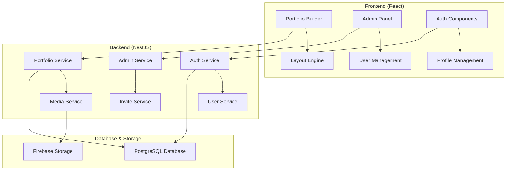

# Design Document

## Overview

The Designer Portfolio Platform is a full-stack web application built with React frontend, Node.js/NestJS backend with local authentication and PostgreSQL database, using Firebase only for media storage. The system enables artists to create professional portfolios through a drag-and-drop interface, with admin-controlled registration via invite codes and mobile-optimized sharing capabilities.

## Architecture

### System Architecture



### Technology Stack

**Frontend:**
- React 18 with TypeScript
- React DND for drag-and-drop functionality
- React Router for navigation
- Styled Components for theming
- React Query for state management

**Backend:**
- NestJS framework with TypeScript
- PostgreSQL with TypeORM
- Passport.js for local authentication
- bcrypt for password hashing
- Multer for file uploads
- Sharp for image processing
- JWT for session management

**Storage:**
- PostgreSQL for data persistence
- Firebase Storage for media files only

## Components and Interfaces

### Frontend Components

#### Authentication Components
```typescript
interface AuthProps {
  onSuccess: (user: User) => void;
  onError: (error: string) => void;
}

// LoginForm.tsx
export const LoginForm: React.FC<AuthProps>

// RegisterForm.tsx - includes invite code field
export const RegisterForm: React.FC<AuthProps>
```

#### Portfolio Builder Components
```typescript
interface Block {
  id: string;
  type: 'title' | 'richtext' | 'list' | 'images' | 'resume' | 'carousel' | 'divider' | 'link';
  data: any;
  position: number;
}

interface PortfolioData {
  id: string;
  userId: string;
  template: 'gallery' | 'about' | 'contact';
  blocks: Block[];
  theme: string;
  isPublished: boolean;
}

// DragDropBuilder.tsx
export const DragDropBuilder: React.FC<{
  portfolio: PortfolioData;
  onUpdate: (portfolio: PortfolioData) => void;
}>

// Block Components
export const TitleBlock: React.FC<{ data: TitleData }>
export const RichTextBlock: React.FC<{ data: RichTextData }>
export const ListBlock: React.FC<{ data: ListData }>
export const ImagesBlock: React.FC<{ data: ImagesData }>
export const ResumeBlock: React.FC<{ data: ResumeData }>
export const CarouselBlock: React.FC<{ data: CarouselData }>
export const DividerBlock: React.FC<{ data: DividerData }>
export const LinkBlock: React.FC<{ data: LinkData }>

// Template Components
export const GalleryTemplate: React.FC<{ blocks: Block[] }>
export const AboutTemplate: React.FC<{ blocks: Block[] }>
export const ContactTemplate: React.FC<{ blocks: Block[] }>
```

#### Admin Components
```typescript
interface InviteCode {
  code: string;
  isUsed: boolean;
  usedBy?: string;
  createdAt: Date;
  usedAt?: Date;
}

// AdminPanel.tsx
export const AdminPanel: React.FC.  

// InviteCodeManager.tsx
export const InviteCodeManager: React.FC<{
  codes: InviteCode[];
  onGenerate: () => void;
  onDeactivate: (code: string) => void;
}>
```

### Backend Services

#### Authentication Service
```typescript
@Injectable()
export class AuthService {
  async register(email: string, password: string, inviteCode: string): Promise<User>
  async login(email: string, password: string): Promise<{ user: User; token: string }>
  async validateInviteCode(code: string): Promise<boolean>
  async markInviteCodeUsed(code: string, userId: string): Promise<void>
  async hashPassword(password: string): Promise<string>
  async validatePassword(password: string, hash: string): Promise<boolean>
}
```

#### Portfolio Service
```typescript
@Injectable()
export class PortfolioService {
  async createPortfolio(userId: string): Promise<Portfolio>
  async updatePortfolio(portfolioId: string, data: PortfolioData): Promise<Portfolio>
  async publishPortfolio(portfolioId: string): Promise<string> // returns public URL
  async getPublicPortfolio(portfolioId: string): Promise<Portfolio>
}
```

#### Media Service
```typescript
@Injectable()
export class MediaService {
  async uploadImage(file: Express.Multer.File, userId: string): Promise<MediaFile>
  async optimizeImage(file: Express.Multer.File): Promise<OptimizedImages>
  async deleteImage(fileId: string, userId: string): Promise<void>
}

interface OptimizedImages {
  original: string;
  thumbnail: string;
  mobile: string;
  desktop: string;
}
```

#### Admin Service
```typescript
@Injectable()
export class AdminService {
  async generateInviteCode(): Promise<string>
  async getAllInviteCodes(): Promise<InviteCode[]>
  async deactivateInviteCode(code: string): Promise<void>
  async getUserStats(): Promise<UserStats>
  async listUserStats(): Promise<UserStats[]>
}
```

## Data Models

### User Model
```typescript
@Entity('users')
export class User {
  @PrimaryGeneratedColumn('uuid')
  id: string;

  @Column({ unique: true })
  email: string;

  @Column()
  passwordHash: string;

  @Column({ nullable: true })
  name?: string;

  @Column({ type: 'text', nullable: true })
  bio?: string;

  @Column({ nullable: true })
  avatar?: string;

  @Column({ type: 'enum', enum: ['artist', 'admin'], default: 'artist' })
  role: 'artist' | 'admin';

  @CreateDateColumn()
  createdAt: Date;

  @UpdateDateColumn()
  updatedAt: Date;

  @OneToMany(() => Portfolio, portfolio => portfolio.user)
  portfolios: Portfolio[];
}
```

### Portfolio Model
```typescript
@Entity('portfolios')
export class Portfolio {
  @PrimaryGeneratedColumn('uuid')
  id: string;

  @Column()
  userId: string;

  @Column()
  title: string;

  @Column({ type: 'enum', enum: ['gallery', 'about', 'contact'] })
  template: 'gallery' | 'about' | 'contact';

  @Column({ type: 'jsonb' })
  blocks: Block[];

  @Column({ default: 'default' })
  theme: string;

  @Column({ default: false })
  isPublished: boolean;

  @Column({ nullable: true })
  publicUrl?: string;

  @CreateDateColumn()
  createdAt: Date;

  @UpdateDateColumn()
  updatedAt: Date;

  @ManyToOne(() => User, user => user.portfolios)
  @JoinColumn({ name: 'userId' })
  user: User;

  @OneToMany(() => MediaFile, mediaFile => mediaFile.portfolio)
  mediaFiles: MediaFile[];
}

interface Block {
  id: string;
  type: 'title' | 'richtext' | 'list' | 'images' | 'resume' | 'carousel' | 'divider' | 'link';
  position: number;
  data: TitleData | RichTextData | ListData | ImagesData | ResumeData | CarouselData | DividerData | LinkData;
}

interface TitleData {
  text: string;
  level: 1 | 2 | 3 | 4 | 5 | 6;
  alignment: 'left' | 'center' | 'right';
}

interface RichTextData {
  content: string; // HTML content
}

interface ListData {
  items: string[];
  type: 'ordered' | 'unordered';
}

interface ImagesData {
  mediaFileIds: string[];
  layout: 'grid' | 'masonry' | 'single';
  columns?: number;
}

interface ResumeData {
  sections: {
    title: string;
    items: {
      title: string;
      subtitle?: string;
      description?: string;
      date?: string;
    }[];
  }[];
}

interface CarouselData {
  mediaFileIds: string[];
  autoPlay: boolean;
  showDots: boolean;
}

interface DividerData {
  style: 'solid' | 'dashed' | 'dotted';
  thickness: number;
  color?: string;
}

interface LinkData {
  text: string;
  url: string;
  openInNewTab: boolean;
  style: 'button' | 'text';
}
```

### Media Model
```typescript
@Entity('media_files')
export class MediaFile {
  @PrimaryGeneratedColumn('uuid')
  id: string;

  @Column()
  userId: string;

  @Column({ nullable: true })
  portfolioId?: string;

  @Column()
  originalName: string;

  @Column({ type: 'jsonb' })
  urls: {
    original: string;
    thumbnail: string;
    mobile: string;
    desktop: string;
  };

  @Column({ type: 'jsonb' })
  metadata: {
    size: number;
    mimeType: string;
    dimensions: { width: number; height: number };
  };

  @CreateDateColumn()
  createdAt: Date;

  @ManyToOne(() => User)
  @JoinColumn({ name: 'userId' })
  user: User;

  @ManyToOne(() => Portfolio, portfolio => portfolio.mediaFiles)
  @JoinColumn({ name: 'portfolioId' })
  portfolio?: Portfolio;
}
```

### Invite Code Model
```typescript
@Entity('invite_codes')
export class InviteCode {
  @PrimaryColumn()
  code: string; // 6-digit string

  @Column({ default: true })
  isActive: boolean;

  @Column({ default: false })
  isUsed: boolean;

  @Column()
  createdBy: string; // admin user ID

  @Column({ nullable: true })
  usedBy?: string; // user ID who used it

  @CreateDateColumn()
  createdAt: Date;

  @Column({ nullable: true })
  usedAt?: Date;

  @ManyToOne(() => User)
  @JoinColumn({ name: 'createdBy' })
  creator: User;

  @ManyToOne(() => User)
  @JoinColumn({ name: 'usedBy' })
  usedByUser?: User;
}
```

## Error Handling

### Frontend Error Handling
- Global error boundary for React components
- Toast notifications for user feedback
- Form validation with real-time feedback
- Network error retry mechanisms

### Backend Error Handling
```typescript
// Custom exception filters
@Catch(HttpException)
export class HttpExceptionFilter implements ExceptionFilter {
  catch(exception: HttpException, host: ArgumentsHost) {
    // Structured error responses
  }
}

// Common error types
export class InvalidInviteCodeException extends BadRequestException
export class PortfolioNotFoundException extends NotFoundException
export class UnauthorizedAccessException extends UnauthorizedException
```

### Error Response Format
```typescript
interface ErrorResponse {
  statusCode: number;
  message: string;
  error: string;
  timestamp: string;
  path: string;
}
```

## Testing Strategy

### Frontend Testing
- **Unit Tests**: Component testing with React Testing Library
- **Integration Tests**: User flow testing with Cypress
- **Visual Tests**: Snapshot testing for UI consistency

### Backend Testing
- **Unit Tests**: Service and controller testing with Jest
- **Integration Tests**: API endpoint testing
- **E2E Tests**: Full workflow testing including Firebase integration

### Test Coverage Goals
- Minimum 80% code coverage for critical paths
- 100% coverage for authentication and security features
- Performance testing for image upload and optimization

## Security Considerations

### Authentication & Authorization
- Local authentication with bcrypt password hashing
- JWT tokens with short expiration times
- Role-based access control (RBAC)
- Invite code validation to prevent unauthorized registration
- Rate limiting on authentication endpoints
- Passport.js local strategy for login

### Data Protection
- Input validation and sanitization
- File upload restrictions (type, size, malware scanning)
- CORS configuration for frontend-backend communication
- Secure headers implementation

### Privacy
- User data encryption at rest
- Secure image URLs with access controls
- GDPR compliance for user data handling
- Audit logging for admin actions

## Performance Optimization

### Frontend Performance
- Code splitting and lazy loading
- Image lazy loading with intersection observer
- React.memo for expensive components
- Service worker for caching static assets

### Backend Performance
- Database query optimization
- Image processing queue with Bull
- CDN integration for media delivery
- Response caching for public portfolios

### Mobile Optimization
- Responsive design with mobile-first approach
- Progressive Web App (PWA) capabilities
- Optimized images for different screen sizes
- Touch-friendly drag-and-drop interface

## Deployment Architecture

### Production Environment
```mermaid
graph LR
    A[Cloudflare CDN] --> B[Load Balancer]
    B --> C[Frontend (Vercel)]
    B --> D[Backend (Railway/Heroku)]
    D --> E[Firebase Services]
    F[Admin Panel] --> D
```

### Environment Configuration
- Development: Local PostgreSQL database with Firebase Storage
- Staging: Hosted PostgreSQL with Firebase Storage for testing
- Production: Optimized build with monitoring and analytics

This design provides a scalable, secure, and user-friendly platform that meets all the specified requirements while maintaining good performance and maintainability.